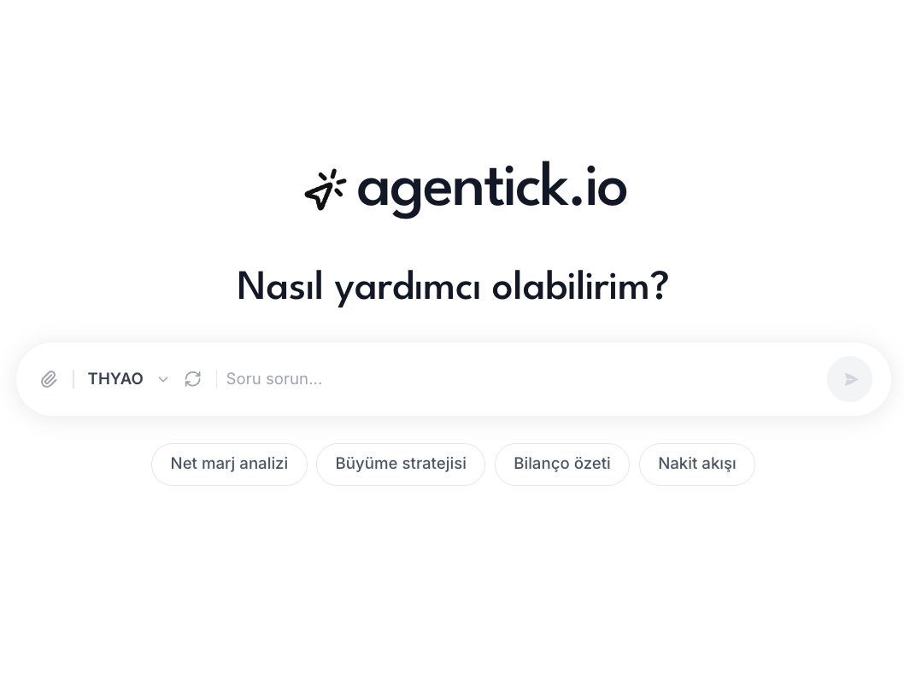

<p align="center">
  
</p>

<h1 align="center">agentick.io</h1>

<p align="center">
  <strong>BIST hisseleri icin Turkce AI finansal analist</strong><br/>
  Agentic RAG · LangGraph · Claude · Qdrant · FastAPI · React
</p>

<p align="center">
  
  
  
  
  
</p>

---

## Ne Yapar?

Turk bireysel yatirimcilarin BIST hisseleri uzerinde **Turkce sorular** sorabilecegi, **kaynakli ve guvenilir** cevaplar aldigi yapay zeka destekli finansal analiz platformu.

- KAP faaliyet raporlari (PDF) yukleyin, yapay zeka tabloyu ve metni anlasin
- yfinance ile canli finansal veriler (gelir tablosu, bilanco, nakit akisi, oranlar)
- Hisseler arasi karsilastirma (F/K, PD/DD, net marj, ROE vb.)
- Portfoy dashboard (K/Z, sektor dagilimi, temettu takvimi, konsantrasyon uyarilari)
- Haberleri takip edin (Bloomberg HT, Dunya gazetesi vb.)

---

## Mimari

```
Kullanici sorusu
      |
      v
  PLANNER (Claude Haiku)  --> soruyu alt gorevlere boler
      |
      v
  ROUTER (asyncio.gather) --> paralel retriever cagrisi
      |
      +-- SQL Retriever      (yfinance + PDF tablolari -- SQLite)
      |                       └── bos donerse --> auto-fetch --> tekrar sorgula
      +-- Vector Retriever   (KAP rapor metni -- Qdrant)
      +-- News Retriever     (RSS haberler -- SQLite)
      |
      v
  CRITIC (Claude Haiku)    --> bilgi yeterli mi? degilse PLANNER'a geri don (max 3 tur)
      |
      v
  SYNTHESIZER (Claude Sonnet 4.6) --> Turkce, kaynakli cevap
```

---

## Teknoloji Stack

| Katman | Teknoloji |
|---|---|
| LLM (Sentez) | Claude Sonnet 4.6 |
| LLM (Planner/Critic/SQL) | Claude Haiku 4.5 |
| Agent Orkestrasyonu | LangGraph |
| Embedding | paraphrase-multilingual-mpnet-base-v2 (lokal, 768D) |
| Vektor DB | Qdrant Cloud (EU-Central-1) |
| Iliskisel DB | SQLite |
| Finansal Veri | yfinance |
| PDF Isleme | pdfplumber (tablolar) + PyMuPDF (metin) |
| Auth | Firebase Authentication (Google OAuth) |
| Backend | FastAPI + Uvicorn |
| Frontend | React 18 + TypeScript + Vite + Tailwind CSS |
| Test | pytest + pytest-asyncio (14 test) |
| CI/CD | GitHub Actions (backend test + frontend build) |
| Gozlemlenebilirlik | LangSmith |

---

## Ozellikler

### Sohbet -- Tekil Hisse Analizi
- BIST-30 hisselerinden birini sec, Turkce soru sor
- Agent PDF, SQL ve haber kaynaklarini paralel tarar
- Sohbet hafizasi (takip sorulari anlasilir)
- Veri yoksa otomatik yfinance'den cekilir (auto-fetch)

### Karsilastirma -- Coklu Hisse
- 2 hisseyi yan yana kiyasla (metrik tablosu)
- F/K, PD/DD, net marj, ROE, ROA, FAVOK vb.
- Serbest soru-cevap (multi-ticker agent)

### Portfoy Dashboard
- Hisse ekleme/cikarma (Firestore'da kalici)
- Toplam deger, K/Z, agirlikli F/K, temettu verimi
- Sektor dagilimi (bar chart)
- Konsantrasyon uyarilari (>%30 hisse, >%40 sektor)
- Temettu takvimi (Turkce tarih)
- Portfoy haberleri + AI soru-cevap

### Guvenlik ve Kalite
- Firebase Auth (Google OAuth) + backend token dogrulama
- BIST-30 ticker whitelist (30 hisse)
- Dosya yükleme: sadece PDF, max 50 MB, guvenli dosya adi
- Tum endpoint'lerde timeout (agent 120s, fetch 60s)
- DB baglanti leak onleme (try/finally)
- Input validation + HTTPException
- `print()` --> `logging` migrasyonu (structured logging)
- 14 test (pytest): health, auth, validation
- CI/CD: GitHub Actions (her push/PR'da otomatik test + build)

---

## API Endpoint'leri

| Method | Endpoint | Aciklama |
|---|---|---|
| GET | `/api/health` | Saglik kontrolu |
| POST | `/api/upload/sync` | PDF yukle ve indexle |
| POST | `/api/ask` | Soru sor, agent yanitini al |
| POST | `/api/fetch-data` | yfinance verisini SQLite'a cek |
| POST | `/api/fetch-news` | Haber verilerini cek |
| GET | `/api/compare/metrics` | 2 ticker icin metrik karsilastirmasi |
| POST | `/api/compare/ask` | Karsilastirma sorusu sor |
| POST | `/api/portfolio/metrics` | Portfoy metrikleri, sektor dagilimi, uyarilar |
| POST | `/api/portfolio/ask` | Portfoy AI soru-cevap |
| POST | `/api/portfolio/news` | Portfoy hisselerine ait haberler |

---

## Kurulum

### Gereksinimler
- Python 3.12+
- Node.js 20+
- [uv](https://github.com/astral-sh/uv) paket yoneticisi
- Qdrant Cloud hesabi (ucretsiz tier yeterli)
- Anthropic API anahtari

### 1. Ortam Degiskenleri

```bash
cp .env.example .env
# .env dosyasini duzenle:
# ANTHROPIC_API_KEY, QDRANT_URL, QDRANT_API_KEY

cp frontend/.env.example frontend/.env
# Firebase config degerlerini ekle
```

### 2. Backend

```bash
uv sync
uv run uvicorn backend.main:app --reload --port 8000
```

### 3. Frontend

```bash
cd frontend
npm install
npm run dev   # http://localhost:5173
```

### 4. Testler

```bash
uv sync --extra dev
uv run pytest tests/ -v
```

---

## Proje Yapisi

```
agentick.io/
├── backend/
│   ├── main.py                   # FastAPI app + logging config
│   ├── auth.py                   # Firebase Auth + dev mode bypass
│   ├── routes/
│   │   ├── query.py              # POST /api/ask (120s timeout)
│   │   ├── upload.py             # POST /api/upload (ticker whitelist, 50MB limit)
│   │   ├── fetch_data.py         # POST /api/fetch-data (60s timeout)
│   │   ├── fetch_news.py         # POST /api/fetch-news
│   │   ├── compare.py            # GET /api/compare/metrics, POST /api/compare/ask
│   │   └── portfolio.py          # POST /api/portfolio/metrics, ask, news
│   └── services/
│       ├── pdf_pipeline.py       # PDF --> SQLite + Qdrant
│       └── metrics_utils.py      # Paylasilan metrik helper'lar
├── src/
│   ├── agent/                    # LangGraph agent
│   │   ├── state.py              # AgentState (tickers alani dahil)
│   │   ├── planner_node.py       # Tek + coklu ticker prompt'lari
│   │   ├── router_node.py        # Auto-fetch + per-task ticker + timeout
│   │   ├── critic_node.py
│   │   ├── synthesizer_node.py   # Tek + karsilastirma prompt'lari
│   │   └── graph.py              # run_agent()
│   ├── retrievers/
│   │   ├── sql_retriever.py      # Text-to-SQL (SQLite, 8 tablo)
│   │   ├── vector_retriever.py   # Qdrant semantic search (singleton, thread-safe)
│   │   └── news_retriever.py     # Haber arama (AND keyword)
│   └── ingestion/
│       ├── bist_finance_client.py    # yfinance --> SQLite (temettu + bedelsiz + sektor)
│       ├── news_client.py            # RSS haber cekme
│       ├── pdf_chunker.py            # PDF --> text chunks
│       └── build_vector_index.py     # chunks --> Qdrant
├── frontend/
│   └── src/
│       ├── main.tsx              # BrowserRouter + AuthProvider
│       ├── App.tsx               # Auth guard + Layout + Routes
│       ├── config/firebase.ts    # Firebase config
│       ├── contexts/AuthContext.tsx
│       ├── constants/tickers.ts  # BIST-30 tek kaynak
│       ├── pages/
│       │   ├── LoginPage.tsx     # Landing page (9 bolum)
│       │   ├── ChatPage.tsx      # Sohbet sayfasi
│       │   ├── ComparePage.tsx   # Karsilastirma sayfasi
│       │   └── PortfolioPage.tsx # Portfoy dashboard
│       ├── components/           # 15+ UI bileseni
│       ├── api/client.ts
│       └── services/
│           ├── conversationStorage.ts
│           └── portfolioService.ts
├── tests/
│   ├── conftest.py               # Shared fixtures (TestClient)
│   ├── test_health.py            # Health endpoint testi
│   ├── test_auth.py              # Auth middleware testleri
│   └── test_validation.py        # 12 input validation testi
├── .github/workflows/ci.yml     # CI/CD pipeline
├── data/
│   ├── raw/                      # Yuklenen PDF'ler
│   └── bist_financials.db        # SQLite
├── pyproject.toml
├── .env.example
└── frontend/.env.example
```

---

## Desteklenen Hisseler (BIST-30)

```
AKBNK  AKSEN  ARCLK  ASELS  BIMAS
EKGYO  ENKAI  EREGL  FROTO  GARAN
GUBRF  HALKB  ISCTR  KCHOL  KONTR
KOZAL  KRDMD  ODAS   PETKM  PGSUS
SAHOL  SASA   SISE   TAVHL  TCELL
THYAO  TOASO  TUPRS  VAKBN  YKBNK
```

---

## Lisans

Bu proje ozel kullanim icindir.
